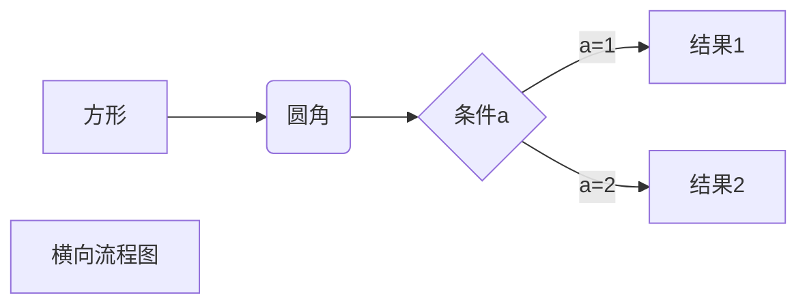
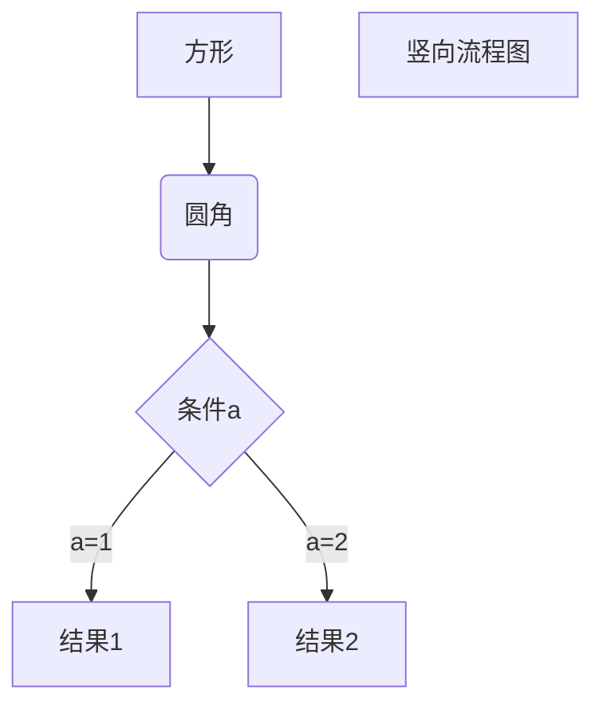
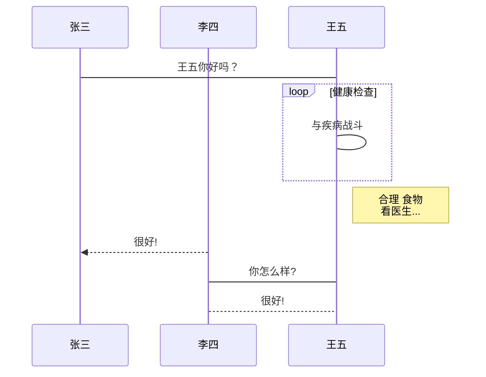
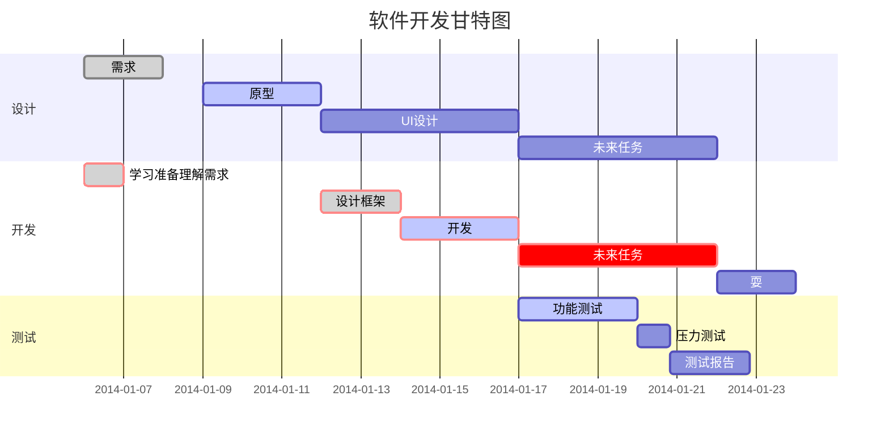

# markdown基本语法

## 1. 标题和段落格式

使用 **=** 和 **-** 标记一级和二级标题，或者使用 **#** 表示标题，几个＃就代表几级标题。

#### 段落

段落**换行使用两个以上空格加回车**或者从**一段后加一个空行**重新开始一个段落。

#### 字体

***斜体***：一个 * 或一个 - 包围住需要处理的字体

**粗体**：两个*或两个- 包围住处理的字体

***粗斜体***：三个*或者三个-包围住处理的字体

#### 分割线

三个以上*或-或者_建立分割线

#### 删除线

在需要处理的文字两端加上[^~~]即可(~~hahaha~~)

#### 下划线

在文字的两端加上[^<u>]...[^</u>]标签

#### 脚注

使用[^]，其中^后跟[^文本]。

[^文本]: 我是一个脚注

_____

## 2. Markdown 列表

* 无序列表

  无序列表使用**星号(*)、加号(+)或是减号(-)作为列表标记，这些标记后面要添加一个空格**，然后再填写内容。

* 有序列表

  直接**数字加上.加空格**即可。

* 列表嵌套

  列表嵌套只需在**子列表中的选项前面添加四个空格**和一个*或+或-即可：

  * ~~这是一个子列表~~

_____

## 3. Markdown区块

Markdown 区块引用是在段落开头使用 > 符号 ，然后后面紧跟一个空格符号。Eg：

> 区块引用
>
> > 区块引用可以嵌套，输入两个或多个>即可
>
> 区块中也可以使用列表：
>
> 1. object 1
> 2. object 2
>
> * object 1
>
> * object 2
>   * object 2.1
>   * object 2.2


当然，列表中也可以使用区块：

* object 1

  > 我是一个引用
  >
  > 我是object 1 的一个引用

* object 2

___________

## 4. Markdown 代码

如果是段落上的**一个函数或片段的代码**可以用反引号把它包起来（[^`]），例如：`printf()`函数

#### 代码区块

代码区块使用 4 个空格或者一个制表符（Tab 键）。

>
>
>​    < ?php 
>
>​	echo 'RUNOOB';
>
>​	function test(){
>
>​		echo 'test';

~~~javascript
```javascript
$(document).ready(function () {
    alert('RUNOOB');
});
```
~~~

_________

## 5. Markdown 链接

链接使用方法：

>[]内写链接名称 ()内写链接地址，例如：
>
>这是一个链接[菜鸟教程](https://www.runoob.com)
>
>或者
>
><链接地址>

#### 高级链接

我们可以通过变量来设置一个链接，变量赋值在文档末尾进行：

这个链接用 1 作为网址变量 [Google][1]
这个链接用 runoob 作为网址变量 [Runoob][runoob]
然后在文档的结尾为变量赋值（网址）

[1]: http://www.google.com/
[runoob]: http://www.runoob.com/

________

## 6. Markdown 图片


Markdown 还没有办法指定图片的高度与宽度，如果你需要的话，你可以使用普通的  标签


_____

## 7. Markdown 表格

Markdown 制作表格使用 | 来分隔不同的单元格，使用 - 来分隔表头和其他行。


| 表头   | 表头   |
| ------ | ------ |
| 单元格 | 单元格 |
| 单元格 | 单元格 |

**对齐方式**

对齐方式

**我们可以设置表格的对齐方式：**

- -: 设置内容和标题栏居右对齐。
- :- 设置内容和标题栏居左对齐。
- :-: 设置内容和标题栏居中对齐。


| 左对齐 | 右对齐 | 居中对齐 |
| :----- | -----: | :------: |
| 单元格 | 单元格 |  单元格  |
| 单元格 | 单元格 |  单元格  |

_____

## 8. Markdown 高级技巧

#### 支持的HTML元素

不在 Markdown 涵盖范围之内的标签，都可以直接在文档里面用 HTML 撰写。

目前支持的 HTML 元素有：`<kbd> <b> <i> <em> <sup> <sub> <br>`等 ，如：

使用 <kbd>Ctrl</kbd>+<kbd>Alt</kbd>+<kbd>Del</kbd> 重启电脑

#### 转义

Markdown 使用了很多特殊符号来表示特定的意义，如果需要显示特定的符号则需要使用转义字符，Markdown 使用反斜杠转义特殊字符。例如：

两个星号代表加粗，如果想要显示型号加上反斜杠：

**文本加粗**

\*\*正常使用星号\*\*

Markdown 支持以下这些符号前面加上反斜杠来帮助插入普通的符号：


#### 公式

当你需要在编辑器中插入数学公式时，可以使用两个美元符 $$ 包裹 TeX 或 LaTeX 格式的数学公式来实现。提交后，问答和文章页会根据需要加载 Mathjax 对数学公式进行渲染。如：

```latex
$$
\mathbf{V}_1 \times \mathbf{V}_2 =  \begin{vmatrix} 
\mathbf{i} & \mathbf{j} & \mathbf{k} \\
\frac{\partial X}{\partial u} &  \frac{\partial Y}{\partial u} & 0 \\
\frac{\partial X}{\partial v} &  \frac{\partial Y}{\partial v} & 0 \\
\end{vmatrix}
${$tep1}{\style{visibility:hidden}{(x+1)(x+1)}}
$$
```

显示效果：
$$
\mathbf{V}_1 \times \mathbf{V}_2 =  \begin{vmatrix} 
\mathbf{i} & \mathbf{j} & \mathbf{k} \\
\frac{\partial X}{\partial u} &  \frac{\partial Y}{\partial u} & 0 \\
\frac{\partial X}{\partial v} &  \frac{\partial Y}{\partial v} & 0 \\
\end{vmatrix}
${$tep1}{\style{visibility:hidden}{(x+1)(x+1)}}
$$

#### typora 画流程图、时序图(顺序图)、甘特图

* 横向流程图

```
​```mermaid
graph LR
A[方形] -->B(圆角)
    B --> C{条件a}
    C -->|a=1| D[结果1]
    C -->|a=2| E[结果2]
    F[横向流程图]
​```
```



* 竖向流程图

```
​```mermaid
graph TD
A[方形] --> B(圆角)
    B --> C{条件a}
    C --> |a=1| D[结果1]
    C --> |a=2| E[结果2]
    F[竖向流程图]
​```
```



* 标准流程图

```
​```flow
st=>start: 开始框
op=>operation: 处理框
cond=>condition: 判断框(是或否?)
sub1=>subroutine: 子流程
io=>inputoutput: 输入输出框
e=>end: 结束框
st->op->cond
cond(yes)->io->e
cond(no)->sub1(right)->op
​```
```

```flow
st=>start: 开始框
op=>operation: 处理框
cond=>condition: 判断框(是或否?)
sub1=>subroutine: 子流程
io=>inputoutput: 输入输出框
e=>end: 结束框
st->op->cond
cond(yes)->io->e
cond(no)->sub1(right)->op
```

* 标准流程图横向：

```
​```flow
st=>start: 开始框
op=>operation: 处理框
cond=>condition: 判断框(是或否?)
sub1=>subroutine: 子流程
io=>inputoutput: 输入输出框
e=>end: 结束框
st(right)->op(right)->cond
cond(yes)->io(bottom)->e
cond(no)->sub1(right)->op
​```
```

```flow
st=>start: 开始框
op=>operation: 处理框
cond=>condition: 判断框(是或否?)
sub1=>subroutine: 子流程
io=>inputoutput: 输入输出框
e=>end: 结束框
st(right)->op(right)->cond
cond(yes)->io(bottom)->e
cond(no)->sub1(right)->op
```

* UML时序图

```
​```sequence
对象A->对象B: 对象B你好吗?（请求）
Note right of 对象B: 对象B的描述
Note left of 对象A: 对象A的描述(提示)
对象B-->对象A: 我很好(响应)
对象A->对象B: 你真的好吗？
​```
```

```sequence
对象A->对象B: 对象B你好吗?（请求）
Note right of 对象B: 对象B的描述
Note left of 对象A: 对象A的描述(提示)
对象B-->对象A: 我很好(响应)
对象A->对象B: 你真的好吗？
```

* UML时序图源码复杂样例

```
​```sequence
Title: 标题：复杂使用
对象A->对象B: 对象B你好吗?（请求）
Note right of 对象B: 对象B的描述
Note left of 对象A: 对象A的描述(提示)
对象B-->对象A: 我很好(响应)
对象B->小三: 你好吗
小三-->>对象A: 对象B找我了
对象A->对象B: 你真的好吗？
Note over 小三,对象B: 我们是朋友
participant C
Note right of C: 没人陪我玩
​```
```

```sequence
Title: 标题：复杂使用
对象A->对象B: 对象B你好吗?（请求）
Note right of 对象B: 对象B的描述
Note left of 对象A: 对象A的描述(提示)
对象B-->对象A: 我很好(响应)
对象B->小三: 你好吗
小三-->>对象A: 对象B找我了
对象A->对象B: 你真的好吗？
Note over 小三,对象B: 我们是朋友
participant C
Note right of C: 没人陪我玩
```

* UML标准时序图样例

```
​```mermaid
%% 时序图例子,-> 直线，-->虚线，->>实线箭头
  sequenceDiagram
    participant 张三
    participant 李四
    张三->王五: 王五你好吗？
    loop 健康检查
        王五->王五: 与疾病战斗
    end
    Note right of 王五: 合理 食物 <br/>看医生...
    李四-->>张三: 很好!
    王五->李四: 你怎么样?
    李四-->王五: 很好!
​```
```



* 甘特图


```
​```mermaid
%% 语法示例
        gantt
        dateFormat  YYYY-MM-DD
        title 软件开发甘特图
        section 设计
        需求                      :done,    des1, 2014-01-06,2014-01-08
        原型                      :active,  des2, 2014-01-09, 3d
        UI设计                     :         des3, after des2, 5d
    未来任务                     :         des4, after des3, 5d
        section 开发
        学习准备理解需求                      :crit, done, 2014-01-06,24h
        设计框架                             :crit, done, after des2, 2d
        开发                                 :crit, active, 3d
        未来任务                              :crit, 5d
        耍                                   :2d
        section 测试
        功能测试                              :active, a1, after des3, 3d
        压力测试                               :after a1  , 20h
        测试报告                               : 48h
​```
```

